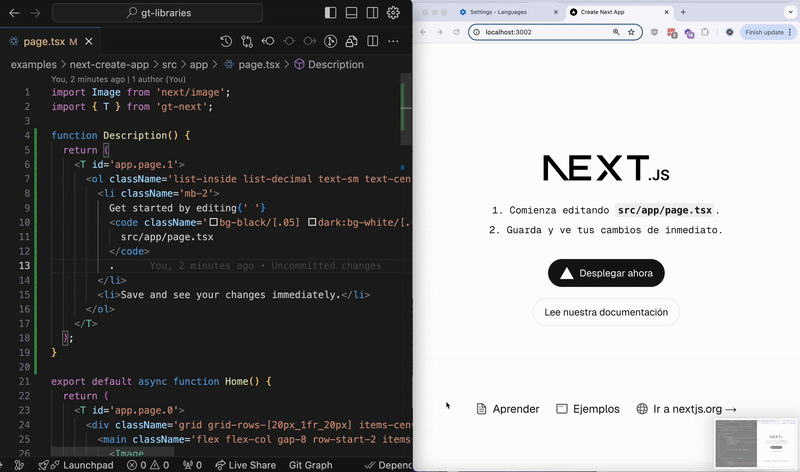

<div align="center">
  <a href="https://generaltranslation.com" target="_blank">
    
  </a>
</div>

<div align="center">

# General Translation

</div>

General Translation (GT) is fully integrated suite of internationalization (i18n) tools for developers.

This open-source repo contains internationalization libraries for React frameworks like Next.js and React Router.

📖&nbsp;&nbsp;For guides, examples, and API references, read the [docs](https://generaltranslation.com/docs).

🔑&nbsp;&nbsp;Create a free API key for the translation service [generaltranslation.com](https://generaltranslation.com)!

💬&nbsp;&nbsp;Join the [Discord community](https://discord.gg/W99K6fchSu) to get help and stay updated!

## Projects

- [gt-next](packages/next/README.md): AI-powered i18n library for Next.js
- [gt-react](packages/react/README.md): AI-powered i18n library for React

- [gtx-cli](packages/cli/README.md): CLI tool for continuous localization

- [generaltranslation](packages/core/README.md): Core TypeScript language infrastructure library

- [supported-locales](packages/supported-locales/README.md): Helper library for currently supported locales on [generaltranslation.com](https://generaltranslation.com)

## Add the `<T>` component and see translations as you code:



## Features

### ⚛️&nbsp;&nbsp;Translate entire React components, not just strings

- Just wrap your content in a `<T>` component!
- No need for complex refactoring or managing JSON files.

```tsx
export default function Page() {
  return (
    <T>
      <p>You can write any JSX as children of the {'<T>'} component.</p>
      <p>
        For example, you could write a <a href='/'>link</a> and have the text be
        translated in context.
      </p>
      <div>
        <div>
          <p>Even deeply nested components are translated in context.</p>
          <button>Click me!</button>
        </div>
      </div>
    </T>
  );
}
```

### 🔎&nbsp;&nbsp;Feature parity with existing libraries

- GT libraries also support the same features as existing libraries like `next-intl` and `react-i18next`.
- Features such as dictionaries, plurals, currencies, and automatic routing are all supported.

### 🔧&nbsp;&nbsp;Developer-friendly

- Setup is simple and can be done in minutes.
- All GT libraries are open-source and work standalone.
  - You can use your own translation provider or use our free AI-powered translation service.
- No more managing translation keys like `t('menu.header.title')`.
  - Just write everything in-line!

### 🧠&nbsp;&nbsp;Free, context-aware AI translation service

- Translation hot reload in development
- Libraries integrate natively with the translation platform.
- Translations are generated for your app in seconds.
- HTML content is re-arranged and customized according to the language.

## Examples

See the [examples](examples) directory for some example projects that use our libraries.

## Installation

Any of the libraries can be installed via npm, yarn, pnpm, or bun.

For example, to install `gt-next`:

```bash
npm install gt-next
yarn add gt-next
```

See the [docs](https://generaltranslation.com/docs) for more information.

## Contributing

We welcome any contributions to the libraries. Please submit a pull request!
