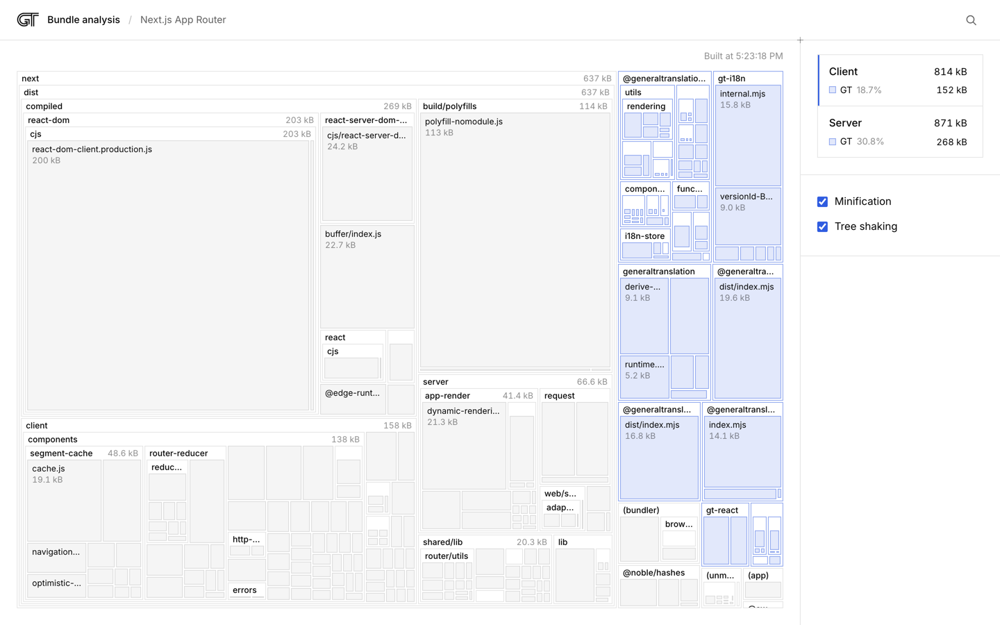

# Bundle analysis

A live view of how much JavaScript the GT packages add to a real app. The tool
runs the production build of an example app, attributes every emitted byte to
the package that contributed it (from source maps), and redraws the treemap
whenever a package's `dist` output changes.



```sh
pnpm watch            # terminal 1: rebuild packages on save
pnpm analyze:bundle   # terminal 2: opens http://localhost:4600
```

Choose an example on the home page. Opening one runs its production build; after
that, every package rebuild from `pnpm watch` and every edit in the example's
own source triggers a new build. The sidebar shows each bundle's size, the
bytes and share that come from GT packages, and the change since the previous
build. Files that changed are marked in the treemap.

## Agents

The server is also a JSON API, so coding agents can measure bundle size
without the UI. `GET /llms.txt` explains it; `GET /api` lists the endpoints.

```sh
curl -s 'http://localhost:4600/api/examples/next-app?fresh=1'          # sizes, GT bytes and share, change
curl -s 'http://localhost:4600/api/examples/next-app/bundles/client?package=gt-i18n'
curl -s 'http://localhost:4600/api/examples/vite-react/diff/client'    # files that changed since the last build
curl -s -X POST 'http://localhost:4600/api/examples/vite-react/build?wait=1'
```

`fresh=1` rebuilds first when sources changed and waits for the result.

## Layout

| Path                      | Contents                                                        |
| ------------------------- | --------------------------------------------------------------- |
| `analysis-app/server`     | Node server: builds, source-map attribution, watchers, SSE      |
| `analysis-app/src`        | React UI (home page and analysis page)                          |
| `analysis-app/shared`     | Types shared by the server and the UI                           |
| `examples/next-app`       | `gt-next`, Next.js App Router quickstart (client, server)       |
| `examples/tanstack-start` | `gt-tanstack-start`, TanStack Start quickstart (client, server) |
| `examples/vite-react`     | `gt-react`, React SPA quickstart (client)                       |
| `examples/vite-vue`       | `gt-vue`, Vue quickstart (client)                               |
| `brand`                   | GT brand tokens and mark shared by the UI and the examples      |

Each example follows its framework's quickstart at
generaltranslation.com/docs, except that the translation files are committed
(there is no API key to run `gt translate`) and the bundler config honors the
variables below. A framework only shows the bundles its build emits; the Next.js
quickstart has no middleware, so there is no edge bundle.

The examples are workspace packages, so they use the `dist` output of
`packages/*` directly through `workspace:*` links. Nothing is copied or packed.

## How a build is measured

The server runs `pnpm run build` in the example with these variables, which
every example's bundler config reads:

| Variable                 | Effect                                      |
| ------------------------ | ------------------------------------------- |
| `GT_ANALYZE=1`           | Emit client and server source maps          |
| `GT_ANALYZE_MINIFY=0`    | Disable minification (Minification setting) |
| `GT_ANALYZE_TREESHAKE=0` | Disable tree shaking (Tree shaking setting) |

Each emitted JS file's bytes are charged to the original source of the nearest
preceding source-map segment, then grouped by package. Sizes are uncompressed
bytes on disk; the API also reports the gzip total (`gzipBytes`). CSS is not
counted.

GT bytes are attributed to the packages' published `dist/` files in every
example. The Next.js example sets `turbopackInputSourceMaps: false` in analyze
mode so Turbopack does not follow the packages' own source maps back to `src/`.

## Adding an example

1. Create `examples/<name>` as a workspace package that depends on the GT
   package with `workspace:*`, and make its bundler config honor the variables
   above.
2. Register it in `analysis-app/server/examples.ts` with the globs for each
   bundle it emits.
3. Optionally add a 1280x800 `preview.png` for the home page card.

## Tests

```sh
pnpm --filter gt-bundle-analysis test              # unit tests
pnpm --filter gt-bundle-analysis test:integration  # builds every example
pnpm --filter gt-bundle-analysis test:e2e          # headless Chromium, live loop
```
